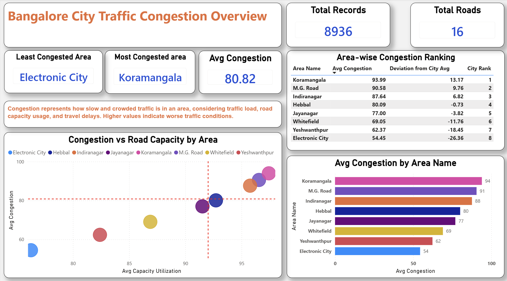
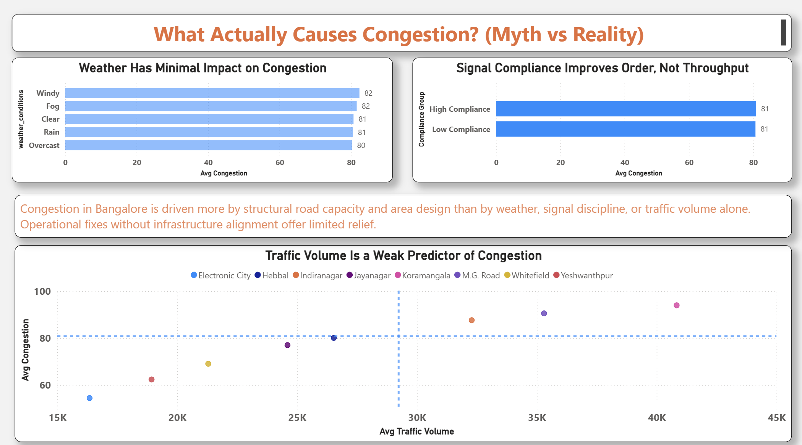

# 🚦 Bangalore Traffic Congestion Analysis

Analyzing traffic congestion patterns in Bangalore to understand structural bottlenecks, debunk common myths, and support data-driven urban planning decisions using SQL and Power BI.

---

## 📌 Table of Contents

- [Overview](#overview)
- [Business Problem](#business-problem)
- [Dataset](#dataset)
- [Tools & Technologies](#tools--technologies)
- [Data Cleaning & Preparation](#data-cleaning--preparation)
- [Analysis & Key Insights](#analysis--key-insights)

---

## Overview

This project explores traffic congestion across major areas in Bangalore, focusing on **capacity utilization, traffic volume, compliance behavior, and environmental factors**.  
The goal is to move beyond assumptions and identify what *actually* drives congestion.

---

## Business Problem

Urban congestion is often blamed on traffic volume, weather, or signal discipline.  
This project aims to:

- Identify the most and least congested areas
- Compare congestion against road capacity utilization
- Test common assumptions about congestion causes
- Highlight structural and infrastructural bottlenecks
- Support long-term, data-backed policy thinking

---

## Dataset

- **Dataset file:** [Bangalore_traffic_Dataset.csv](./data/Bangalore_traffic_Dataset.csv)
- Format: CSV
- Granularity: Area-level traffic observations
- Key fields include:
  - Area name
  - Traffic volume
  - Congestion level
  - Road capacity utilization
  - Signal compliance
  - Weather conditions

---

## Tools & Technologies

- **SQL**  
  - Filtering, aggregation, ranking
  - Deriving city-level benchmarks

- **Power BI**  
  - Interactive dashboards
  - Scatter, bar, and ranking visuals
  - Reference lines and comparisons

- **GitHub**  
  - Project documentation
  - Version control

---

---

## Data Cleaning & Preparation

Key preparation steps included:

- Removing incomplete or invalid traffic records
- Standardizing area and road names
- Validating congestion and capacity utilization ranges
- Converting data types and resolving inconsistencies
- Creating derived measures such as:
  - Average Congestion
  - Average Traffic Volume
  - Average Capacity Utilization
  - City-wide baseline metrics

---

## Analysis & Key Insights

- Congestion varies significantly across areas
- High traffic volume alone does **not** guarantee high congestion
- Signal compliance improves order but not throughput
- Weather impact on congestion is minimal
- Structural capacity and area design play a dominant role

---

## Dashboard

### 📊 Page 1 — City Congestion Overview

This page provides a city-level snapshot, highlighting:

- Average congestion benchmarks
- Area-wise congestion ranking
- Deviation from city average
- Relationship between congestion and road capacity

---

### 🔍 Page 2 — Root Cause Analysis (Myth vs Reality)

This page challenges common assumptions by analyzing:

- Traffic volume vs congestion
- Signal compliance vs congestion
- Weather impact on congestion

**Key takeaway:**  
Congestion in Bangalore is driven more by **structural capacity constraints** than by short-term operational factors.

---

## Policy & Infrastructure Implications

- Expanding road capacity without redesign may offer limited relief
- Area-level planning matters more than volume control alone
- Signal discipline improves safety, not throughput
- Long-term congestion reduction requires:
  - Capacity alignment
  - Smarter road design
  - Area-specific infrastructure planning

---

## How to Run This Project

1. Clone the repository

---

## Data Cleaning & Preparation

Key preparation steps included:

- Removing incomplete or invalid traffic records
- Standardizing area and road names
- Validating congestion and capacity utilization ranges
- Converting data types and resolving inconsistencies
- Creating derived measures such as:
  - Average Congestion
  - Average Traffic Volume
  - Average Capacity Utilization
  - City-wide baseline metrics

---

## Analysis & Key Insights

- Congestion varies significantly across areas
- High traffic volume alone does **not** guarantee high congestion
- Signal compliance improves order but not throughput
- Weather impact on congestion is minimal
- Structural capacity and area design play a dominant role

---

## Dashboard

### 📊 Page 1 — City Congestion Overview

This page provides a city-level snapshot, highlighting:

- Average congestion benchmarks
- Area-wise congestion ranking
- Deviation from city average
- Relationship between congestion and road capacity

---

### 🔍 Page 2 — Root Cause Analysis (Myth vs Reality)

This page challenges common assumptions by analyzing:

- Traffic volume vs congestion
- Signal compliance vs congestion
- Weather impact on congestion

**Key takeaway:**  
Congestion in Bangalore is driven more by **structural capacity constraints** than by short-term operational factors.

---

## Policy & Infrastructure Implications

- Expanding road capacity without redesign may offer limited relief
- Area-level planning matters more than volume control alone
- Signal discipline improves safety, not throughput
- Long-term congestion reduction requires:
  - Capacity alignment
  - Smarter road design
  - Area-specific infrastructure planning

---

## How to Run This Project

1. Clone the repository
git clone https://github.com/Adimsdcr7/bangalore_traffic_project.git

2. Open SQL scripts to review data preparation logic

3. Open the Power BI file

4. Explore interactive visuals and insights

---

## Author & Contact

**Aditya Pandurang Chaudhari**  
Data Analyst  

📧 Email: adichaudhari7@gmail.com  
🔗 LinkedIn: https://linkedin.com/in/aditya-pandurang-chaudhari  
🌐 Portfolio:  
https://www.notion.so/aditya7-portfolio/Aditya-Pandurang-Chaudhari-Data-Analyst-2df4acd69e2e803ebf88c15ea190d8f3

